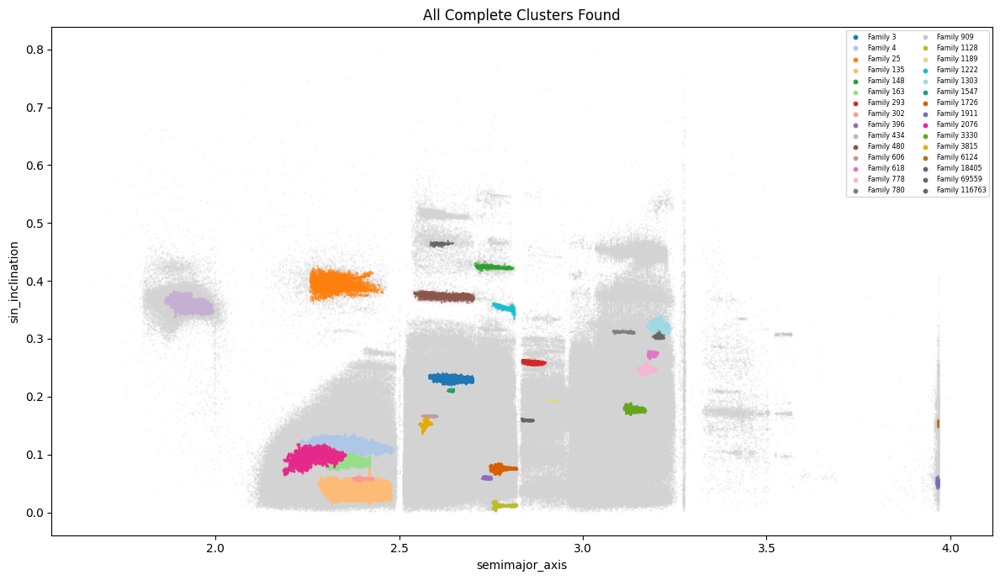
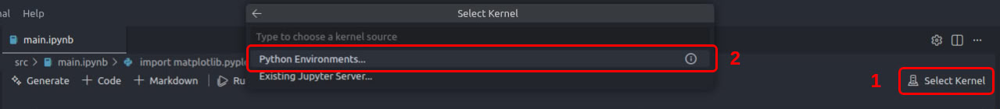
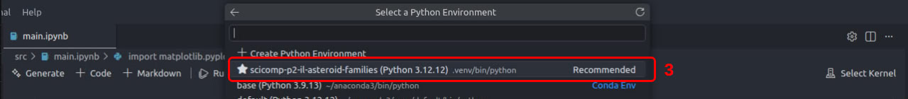

# Clustering of Asteroid Families

Identification of asteroid families using hierarchical clustering.



## Usage

All code is run and can be viewed in `main.ipynb` and `parameter_sweep.ipynb`.
If you wish to run the code yourself, follow the instructions below:

```
# Clone the repository
git clone https://github.com/olincollege/scicomp-p2-il-asteroid-families.git
cd scicomp-p2-il-asteroid-families

# Install uv package manager (if you don't have it already)
pip install uv

# Create virtual environment & install dependencies
uv sync
```

Open `main.ipynb` or `parameter_sweep.ipynb` and selected the created virtual
environment as the kernel with the following steps:

1. Click "Select Kernel" in the top right of the notebook.
2. Click "Python Environments..."
3. Select the environment "scicomp-p2-il-asteroid-families (Python #.##.##)"




