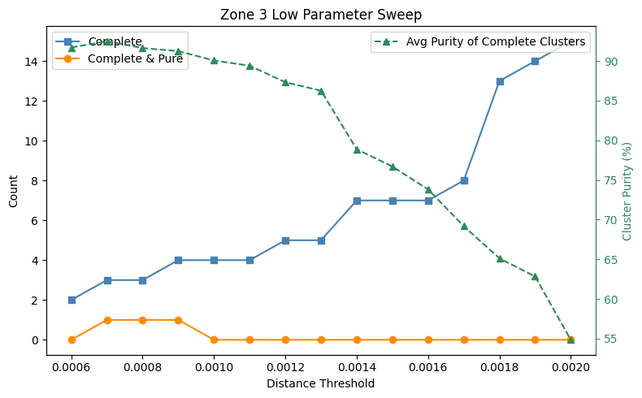
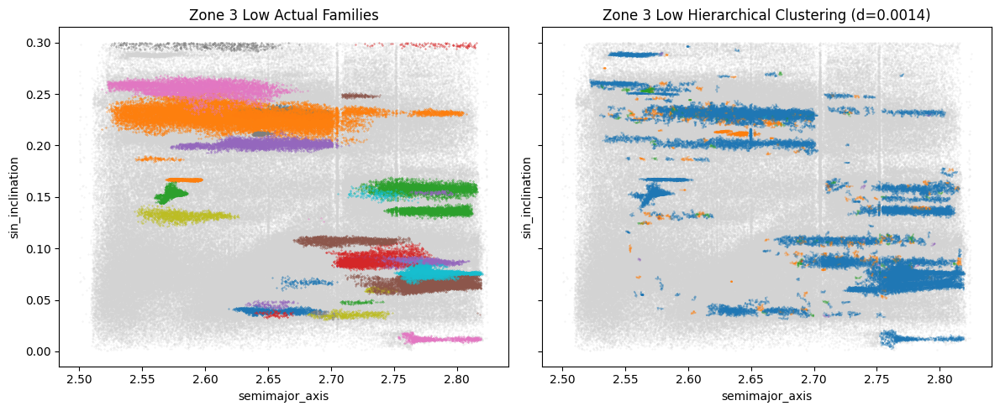

# Clustering of Asteroid Families

Identification of asteroid families using hierarchical clustering.


## Usage

All code is run and can be viewed in `main.ipynb` and `parameter_sweep.ipynb`.
If you wish to run the code yourself, follow the instructions below:

```
# Clone the repository
git clone https://github.com/olincollege/scicomp-p2-il-asteroid-families.git
cd scicomp-p2-il-asteroid-families

# Install uv package manager (if you don't have it already)
pip install uv

# Create virtual environment & install dependencies
uv sync
```

Open `src/main.ipynb` or `src/parameter_sweep.ipynb` and selected the created
virtual environment as the kernel with the following steps:

1. Click "Select Kernel" in the top right of the notebook.
2. Click "Python Environments..."
3. Select the environment "scicomp-p2-il-asteroid-families (Python #.##.##)"


## Data

Asteroid data is sourced from
[AstDyS-2](https://newton.spacedys.com/astdys2/index.php?pc=5). The datasets are
downloaded in this repo under `data/raw/`:

- [Numbered and multiopposition asteroids](https://newton.spacedys.com/~astdys2/propsynth/all.syn)
  (used for clustering)
- [Individual asteroid family membership](https://newton.spacedys.com/~astdys2/propsynth/all_tro.members)
  (answer key of correct families)
- [Asteroid families](https://newton.spacedys.com/~astdys2/propsynth/all_tro.famtab)
  (unused but useful reference)

These raw text files are preprocessed into `.csv` files under `data/`, by the
code `scripts/process_raw_data.py`.

## Methodology

### Zoning

The asteroids are first divided into smaller zones, as defined by
[Milani et al. (2014). Asteroid families classification: Exploiting very large datasets](https://arxiv.org/pdf/1312.7702).
These zones split asteroids by semimajor axis and inclination, as shown in the
table below:

| Zone   | Sine of Inclination | Semimajor Axis Range |
| ------ | ------------------- | -------------------- |
| 1      | all                 | 1.600 - 2.000        |
| 2 low  | < 0.3               | 2.000 - 2.500        |
| 2 high | > 0.3               | 2.000 - 2.500        |
| 3 low  | < 0.3               | 2.500 - 2.825        |
| 3 high | > 0.3               | 2.500 - 2.825        |
| 4 low  | < 0.3               | 2.825 - 3.278        |
| 4 high | > 0.3               | 2.825 - 3.278        |
| 5      | all                 | 3.278 - 3.700        |
| 6      | all                 | 3.700 - 4.000        |

### Parameter Sweep

Hierarchical clustering is then performed on each zone, using Scikit-learn's
[AgglomerativeClustering](https://scikit-learn.org/stable/modules/generated/sklearn.cluster.AgglomerativeClustering.html).
Hierarchical clustering is dependent on a distance threshold parameter and in
order to find the optimal value for this parameter, a sweep is performed across
a range of values.

The efficacy of each distance threshold was evaluated by how well each resulting
cluster captured its "main family," the family that has the most members in the
cluster. The following metrics were used to evaluate the quality of the
clusters:

1. **Completeness**: The percentage of the main family that is captured by the
   cluster. A cluster is considered **complete** if it captures at least 95% of
   its main family.
2. **Purity**: The percentage of the cluster that belongs to the main family. A
   cluster is considered **pure** if at least 95% of its members belong to the
   main family.

Each parameter sweep plot shows the following metrics for each distance
threshold:

- The number of **complete** clusters found (blue)
- The number of **complete and pure** clusters found (orange)
- The average **purity** of **complete** clusters (green)



Distance thresholds that yield a high number of complete clusters, while
maintaining a high average purity, were chosen as optimal thresholds for
hierarchical clustering.

With the example of Zone 3 Low, a distance threshold of 0.0014 was chosen,
sacrificing some cluster purity for a greater number of complete clusters found.

Further explanation of the choice of distance thresholds can be found in
`src/parameter_sweep.ipynb`.

### Clustering

After distance thresholds are determined for each zone, hierarchical clustering
is performed on each zone. Below is a comparison of the resulting clusters found
in Zone 3 Low on the right, with the actual families on the left. Each color
represents a different cluster/family, with grey points representing asteroids
that do not belong to any cluster/family (for the clustering plot on the right,
clusters with fewer than 10 members were ignored and also colored grey).



Hierarchical clustering was able to find a number of smaller clusters in Zone 3
Low, but struggled to find larger, more spread out families. This is likely due
to more of these, smaller, denser families existing in this zone, and the fact
that hierarchical clustering will succeed at finding similarly spread out
families, due to the distance threshold.

Further discussion of the clustering can be found in `src/main.ipynb`.

## Results
